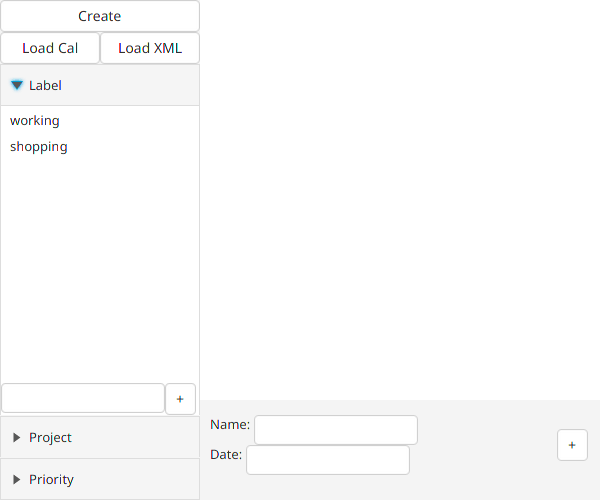
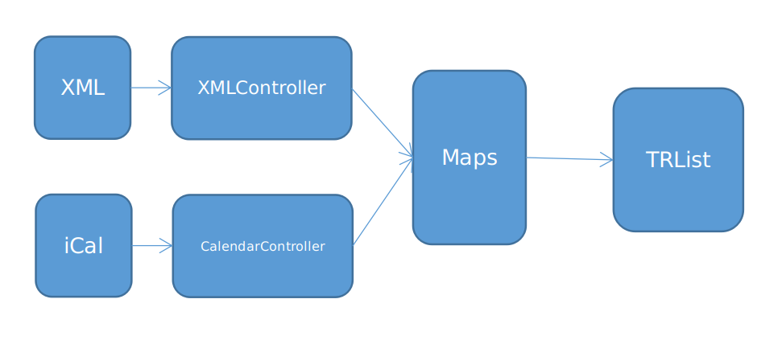

# TRList
A lite To Do List app.

It may not good enough compared with Todoist and other charged apps, but it work well at daily usage. And I promise it won't sent any information to anywhere since it can't connect to Internet. Therefore, please feel safe to use it.

You can create new filters and create new events in this app. If you have used this before, you can load it by click "Load Cal" and "Load XML" button.

## The preview of TRList

## The Structure of Project

